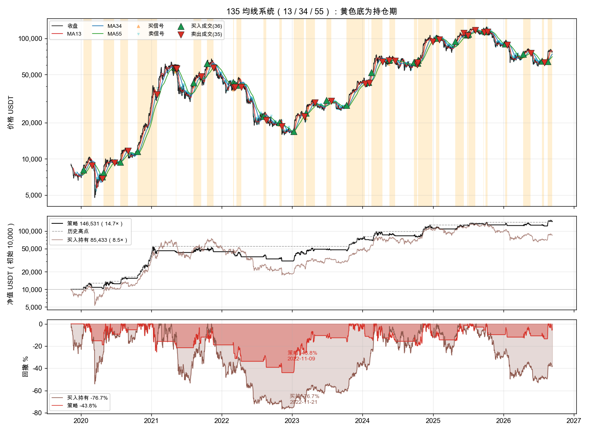
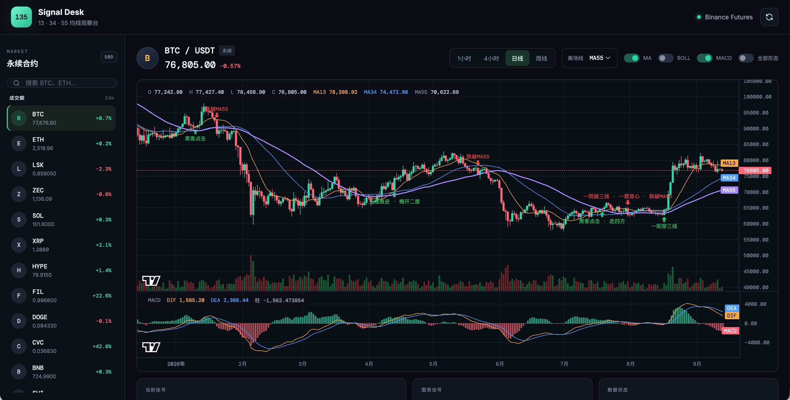

**Language:** English | [中文](README.zh-CN.md)

# 135 Moving Average System

A small Python toolkit for Ning Junming’s **13 / 34 / 55** moving-average method.

- Market data: **Binance**
- Live orders: **Gate.io USDT perpetuals**
- Web desk: chart + signals on top of the same core

This is a research / teaching skeleton. It is not a full copy of the original 55 chart patterns, and it is not investment advice.

## Layout

```
src/njm135/
  core/       MAs, patterns, buy/sell signals (no exchange code)
  market/     Binance klines, CSV, synthetic data
  risk/       Stops, cooldown, regime filter (shared by backtest and live)
  backtest/   Next-open fills, equity plots
  live/       Broker protocol, Gate adapter, polling loop
web/          Chart desk for USDT perps
```

Flow: `market` pulls closed bars → `core` tags patterns → `backtest` or `live` acts on them.

## How it works

“135” comes from the first digits of Fibonacci **13, 34, 55**.

| MA | Role |
|----|------|
| MA13 | Short-term strength. A close below it often means get out. |
| MA34 | Bridge between 13 and 55. A cross up through 55 is “MA swap”. |
| MA55 | Mid-term trend / long-short line |

Defaults: SMA, **close confirmation**. Thresholds live in `PatternParams`.

### Classic 13 patterns

Original Chinese names are kept in parentheses.

| Stage | Pattern | Rule of thumb | Default role |
|-------|---------|---------------|--------------|
| Bottom | Red apricot over the wall (红杏出墙) | Bear stack, MA13 flattening, close through 13 | Buy |
| Bottom | Ants climbing a tree (蚂蚁上树) | Tight MAs, a run of small green bars through 55 | Buy |
| Start | Hacker click (黑客点击) | After a break of 55, a quiet pullback to the 13/55 knot | Buy |
| Start | Lady in red (红衣侠女) | 13 golden-cross 55 + a high-volume green bar | Mark only |
| Rally | Moon from the sea (海底捞月) | 13 crosses below the slower MAs, then golden-crosses 55 | Mark only |
| Rally | MA swap (均线互换) | 34 crosses up through 55 | Buy |
| Rally | Three-line push (三线推进) | The three MAs tighten, then all slope up | Mark only |
| Rally | Plum blossoms twice (梅开二度) | 13 death-crosses 34, then golden-crosses it again | Buy |
| Pause | Walking the square (走四方) | Uptrend, sideways around 13 | Watch |
| Pause | Prodigal returns (浪子回头) | A string of red bars tags 55, then a green bar turns up | Mark only |
| Top | One branch stands out (一枝独秀) | High, stretched off 13, long upper wick | Sell with `--top-exits` |
| Top | Alone on the high tower (独上高楼) | High gap-up open, closes red | Sell with `--top-exits` |
| Top | Take profit and leave (见好就收) | 13/55 stretch >10% and DIF rolls over | Sell with `--top-exits` |

The default book only **trades** the cleanest setups:

- **Buy:** red apricot, ants, hacker click, MA swap, plum blossoms twice, one green through three MAs
- **Sell:** one red through three MAs, arrow through the heart, plus a split-off and “below the exit MA”

If a bar is both buy and sell, **sell wins**. The three top patterns are marks only unless you pass `--top-exits` (or the per-pattern flags `--exit-yizhi` / `--exit-dushang` / `--exit-jianhao`).

“Below the MA” is a **state** (every close under the line), not a one-bar cross. A cross-only exit misses longs that were opened under the MA (hacker click can do that). Exit MA is `--exit-ma 13|34|55`. The CLI default is **full-size MA55**. MA13 is closer to the book and holds for less time.

Ants climbing a tree never fires on BTC daily (five small green bars + MAs within 3% is too tight). Treat it as off.

Signals print on a **closed** bar and fill near the **next open**. Same rule in backtest and live.

The summary prints CAGR, buy-and-hold, Sharpe, Sortino, Calmar, max drawdown (and longest DD days), profit factor, average win/loss, and average hold. Sharpe uses equity returns, rf = 0, and 24/7 crypto bars-per-year.

The plot has three panes: log price (yellow = in trade; big triangles = **fills**; dots = signals), equity vs buy-and-hold, drawdown. A signal is not a fill. Extra buy signals while already long are ignored.



Local CSV, full size, 0.1% fee. Daily sample: 2019-11-10 → 2026-09-12 (2499 bars). 4h starts 2024-06, 1h starts 2025-07 — don’t compare them to daily.

BTCUSDT futures daily:

| Setup | Trades | Win | Total | CAGR | Sharpe | Max DD | Calmar | PF |
|-------|--------|-----|-------|------|--------|--------|--------|-----|
| MA13 | 52 | 42.3% | 204% | 17.7% | 0.83 | -41.0% | 0.43 | 2.52 |
| MA34 | 32 | 46.9% | 1036% | 42.7% | 1.28 | -44.3% | 0.96 | 5.75 |
| MA55 (default) | 35 | 40.0% | 1365% | 48.1% | 1.30 | -43.8% | 1.10 | 5.62 |
| MA55 + 2-loss / 30-bar cooldown | 32 | 43.8% | 1567% | 50.9% | 1.36 | -36.0% | 1.41 | 6.67 |
| Buy & hold | — | — | 754% | — | — | -76.7% | — | — |

Same daily file, MA55 full size, top patterns as sells (`--top-exits`). “Alone on the high tower” fired 0 times. “Take profit and leave” fired 60 times, “one branch” 16 times — mostly cutting winners early:

| Setup | Trades | Win | Total | CAGR | Sharpe | Max DD | Calmar | PF |
|-------|--------|-----|-------|------|--------|--------|--------|-----|
| MA55 (tops off, default) | 35 | 40.0% | 1365% | 48.1% | 1.30 | -43.8% | 1.10 | 5.62 |
| `--top-exits` | 36 | 41.7% | 189% | 16.8% | 0.86 | -33.6% | 0.50 | 2.74 |
| `--exit-yizhi` only | 35 | 42.9% | 333% | 23.9% | 0.98 | -36.8% | 0.65 | 3.08 |
| `--exit-jianhao` only | 36 | 41.7% | 229% | 19.0% | 0.91 | -34.8% | 0.55 | 2.96 |
| `--exit-dushang` only | 35 | 40.0% | 1365% | 48.1% | 1.30 | -43.8% | 1.10 | 5.62 |

Same knobs on shorter BTCUSDT futures bars:

| TF | Setup | Trades | Total | Sharpe | Max DD | Buy & hold |
|----|-------|--------|-------|--------|--------|------------|
| 4h | MA55 | 109 | -16.1% | -0.20 | -48.4% | +14.0% |
| 4h | MA55 + cooldown + MA100 | 58 | +41.1% | 0.87 | -19.9% | +14.0% |
| 1h | MA55 | 225 | -41.3% | -1.93 | -42.8% | -34.7% |

1h is too noisy. 4h MA55 alone still loses; cooldown + a slow MA filter beats buy-and-hold, but the sample is only ~2.3 years. Daily is the timeframe this ruleset can stand on.

ETHUSDT futures daily, MA55 full size: +3248% total, Sharpe 1.25, max DD -62.5%, buy-and-hold +1555%. Bigger return, deeper hole. No extra tuning.

### Position exits

Pattern flags have no memory of entry price, so `njm135.risk` owns `RiskConfig` / `RiskManager`. Backtest and live share it.

```bash
python -m njm135 backtest --csv data/BTCUSDT_futures_1d.csv --exit-ma 55 --trailing 0.10
```

- `--stop-loss 0.08` hard stop vs entry
- `--trailing 0.10` trail vs highest close while in the trade
- `--atr-stop 3` ATR trail
- `--loss-streak 2 --cooldown-bars 30` sit out 30 bars after two losses
- `--regime-ma 100` no new longs while close is under MA100

Cooldown and MA100 only block **new** entries. They do not flatten an open trade.

Fills are always on the **next open** after a closed bar. We do not assume a resting stop on the exchange, so you will not get optimistic “hit the stop tick-perfect” fills. Trades carry `exit_reason`: `signal` / `stop` / `trail` / `atr`.

## Install

```bash
python3 -m venv .venv
source .venv/bin/activate
pip install -e ".[dev]"
```

For live trading, add the Gate SDK:

```bash
pip install -e ".[dev,live]"
```

## Backtest (Binance)

```bash
python -m njm135 backtest --symbol BTCUSDT --interval 1d --kind futures --limit 1500

python -m njm135 backtest --csv data/BTCUSDT_futures_1d.csv
python -m njm135 backtest --csv data/BTCUSDT_futures_1d.csv --top-exits
python -m njm135 backtest --csv data/BTCUSDT_futures_1d.csv --exit-jianhao
```

Spot: `--kind spot`. Offline: `--demo` or `--csv klines.csv`. Top patterns are marks unless `--top-exits` is on. `--no-exit-jianhao` can turn one of them off after that.

Fetch bars (writes under `data/` by default):

```bash
python -m njm135 fetch --symbol BTCUSDT --interval 1d --kind futures --limit 2500
```

`--limit` pages backward; over 1000 bars means more than one request.

## Live (Binance signals, Gate orders)

Default is an in-memory paper book (it tracks PnL, it does not hit Gate):

```bash
export GATE_API_KEY=...
export GATE_API_SECRET=...
python -m njm135 live --symbol BTCUSDT --interval 15m --once \
  --exit-ma 55 --loss-streak 2 --cooldown-bars 30 --regime-ma 100
```

Real orders need `--live`:

```bash
python -m njm135 live --symbol BTCUSDT --interval 15m --live --position-pct 0.3
```

Pass Binance symbols (`BTCUSDT`). The live layer maps them to Gate (`BTC_USDT`). Klines use Binance public REST — no Binance key.

No Gate account? [Sign up](https://www.gatewebsite.com/share/VVNAULXZAG).

## Web desk

`web/` is a separate chart UI. The backend reuses `njm135.core`; the browser does not reimplement the strategy.

- All tradeable Binance USDT perps; sort by 24h volume or % change
- 1h / 4h / 1d / 1w; forming bar included, last bar polled every 2s
- Candles + volume; MA / Bollinger / MACD / ATR% toggles; invert the main scale
- Strategy arrows, recent signals, optional full classic-pattern overlay
- Exit MA: 13 / 34 / 55



```bash
pip install -e ".[web]"
python -m web
```

Open <http://127.0.0.1:8000>.

## Tests

```bash
pytest
```

## What’s next

The daily long book and Gate poll loop already run. These are known gaps, not the default path yet.

- **Out-of-sample.** MA55, cooldown, and MA100 were picked on the same BTC daily file. Next: walk-forward, and symbols that were not used to tune.
- **Retune top exits.** `--top-exits` works, but “take profit and leave” fires too often on daily BTC (1365% → ~189% total, DD only -44% → -34%). “High tower” never fired. Tune stretch / wick by symbol; don’t turn all three on by default.
- **Hard stops barely help this book.** Average daily MA55 loss is about -3.8%, so an 8% stop almost never hits. A 10% trail cuts DD to ~-38% but total return 1365% → 613%. Cooldown / slow-MA filter is the better lever.
- **Retune some buys.** Ants never fire on BTC daily; hacker click can enter under MA13. Walk real bars per pattern before deciding the default set.
- **Don’t paste daily params onto 1h.** Full-size 1h MA55 is about -41%. 4h needs cooldown + MA100 just to beat buy-and-hold, on ~2.3 years. Use a slower book, or skip 1h.
- **Persist live state.** Loss streak, cooldown, and peak close currently live in RAM. Restart = lost. Write a state file and reconcile with exchange positions.
- **Fills vs live.** Model is close-confirm / next-open. No slippage, funding, or partials. If you later use exchange stop orders, change the fill model or the backtest will look too good.
- **Sizing and multi-symbol.** Full-size daily DD is still -36% to -44%. Scale `--position-pct` with vol or account DD. One `risk` cap across symbols, not a full book on each.
- **Risk engine.** First cut only — plenty of room.
- **Other frameworks.** Combine with a second method if you want a higher bar for entries.
- **Live exits.** A 4h overlay can get you out earlier than the signal MA.

PRs welcome.
